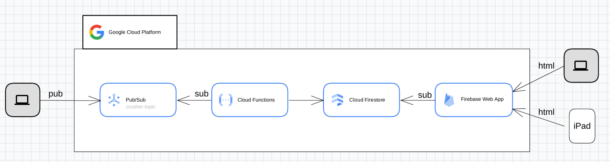
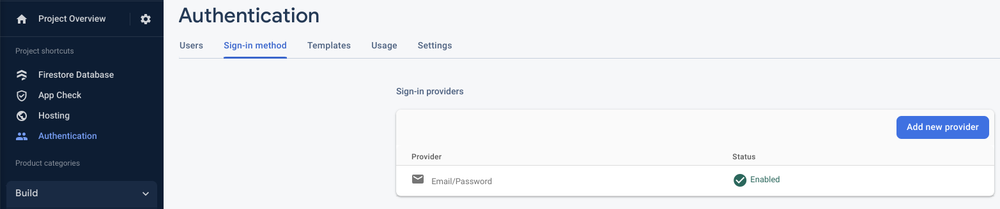

# Pub/sub to Firebase app
Example repository which takes events via Pub/Sub, which triggers a CloudFunction. This CF, in turn, updates a value in Firestore, which is dynamically updated on an HTML page.


## Overall architecture




## Setup

1. Find out your GCP project's id and number from the dashboard in the cloud console, and run the following commands in a terminal at the root of source code (replace `your_project_number` and `your_project_id` by the correct values):
```shell
find . -type f -not -path '*/\.*' -exec sed -i 's/<PROJECT_NMR>/your_project_number/g' {} +
find . -type f -not -path '*/\.*' -exec sed -i 's/<PROJECT_ID>/your_project_id/g' {} +
```

## Install

1. Run the following command at the root of the folder:
```shell 
$ sudo ./install.sh
$ terraform init
$ terraform plan
$ terraform apply
```


2. From the terraform output, update the necessary fields in the `app/public/script.js` under `const firebaseConfig`


3. Deploy the Firebase app
```shell 
$ cd app/
$ npm install -g firebase-tools (if not already present)
$ firebase login
$ firebase use <PROJECT_ID>
$ firebase deploy
```


4. Enable authentication in Firebase, and choose `Email/Password` as the provider




5. Add a new user under the `Users` tab


## Uninstall


1. Manually delete the BigQuery table `stations` in the dataset `data_raw`

2. Run the following at the root of your project

```shell 
$ terraform destroy
```

> All resources will now be removed from your project
